### Houserush抢房项目Jmeter压测与优化

服务器配置： 内存16G，CPU 8核，2.6Ghz

模拟数据：20000用户，抢购498套房

模拟场景流程：

​	1.设置一个n个线程（用户数）,m秒完全启动。（m稍微大点，保证每个用户登录成功。真实的场景也是如此，用户并不是同时登陆）

​	2.查询一次所有的开售活动、查询一次当前要抢的开售活动

​	3.查询一次当前要抢的开售活动，随机获取一个房子订单id

​	4.设置时刻定时器，到达指定时刻，即开始第5步下单，保证所以用户同时开抢

​	5.抢购第三步中随机获取的房子，如果抢购成功则当前用户完成，否则到6

​	6.再次下单该房子，如果再次不成功，则重新查询开售活动，获取一个还没有被抢的房子订单继续下单，最多循环4次。

​	7.结束

##### 1.秒杀流程没有进行优化的初始版本

- 使用zuul gateway；

使用默认配置，不做额外配置。每个微服务都只开一个实例

当并发量为40的时候，出现大量转发错误。

- edge-service

使用默认配置，不做额外配置。每个微服务都只开一个实例

线程数150时，出现数据库连接错误

```shell
#设置增大连接数，mysql5.6默认最大连接数151
show variables like 'max_connection' #查看当前最大连接数
set global max_connections = 10000     #修改最大连接数为10000（临时设置，重启后恢复）
```

最终能跑到1500并发量

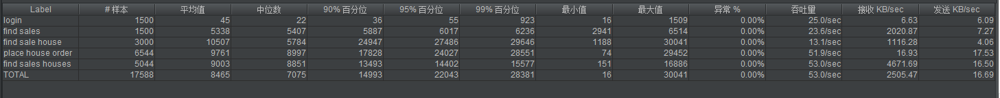

2000并发量，出现异常

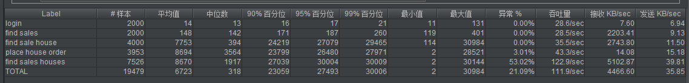


**优化1：按照经验，瓶颈一般容易出现在数据库上。通过打印输出Hibernate自动生成的sql语句，发现查询sale时，一共查询了499次（查询sale1次，查询houseOrder 498次）。这是典型的Hibernate的n+1性能问题。[n+1问题参考](https://www.cnblogs.com/lic309/p/5032855.html) （里面还有一个坑，3表left join fetch时可能会因数据量大报错cannot simultaneously fetch multiple bags）**


解决以上问题后，性能有了极大的提升。

5000线程,两台服务器，一台跑数据库，另一台跑微服务（单一实例）

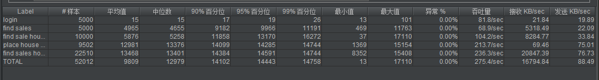

7500线程,两台服务器，一台跑数据库，另一台跑微服务（单一实例）

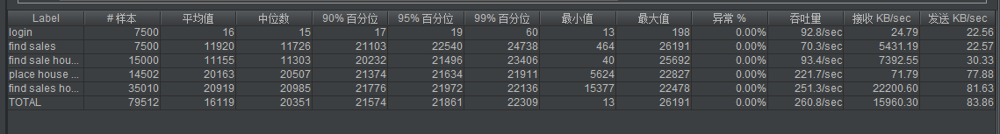


到瓶颈了。

优化2：因机器性能还没跑满，猜测瓶颈应该在数据库上。可以使用[zipkin分布式调用链追踪](https://docs.servicecomb.io/java-chassis/zh_CN/general-development/microservice-invocation-chain.html)和[自定义调用链打点](https://docs.servicecomb.io/java-chassis/zh_CN/general-development/customized-tracing.html)来查看各个微服务及各函数调用的耗时

下单流程

```java
  @Transactional
  public HouseOrder placeHouseOrder(int customerId, int houseOrderId) {
      //1.加锁
    HouseOrder houseOrder = houseOrderDao.findOneForUpdate(houseOrderId);
    Sale sale = houseOrder.getSale();

    if (null != sale && "opening".equals(sale.getState())) {
      if (null == houseOrder.getCustomerId()) {
          //跨微服务调用查询购买资格数
        int qualificationsCount = customerManageApi.getQualificationsCount(customerId, sale.getId());
		  //当前购买数
        int ordersCount = houseOrderDao.countByCustomerIdAndSaleId(customerId, sale.getId());

        if (qualificationsCount <= ordersCount) {
          throw new InvocationException(HttpStatus.SC_BAD_REQUEST, "", "do not have the enough qualification to buy houses in this sale, " +
              "the qualifications count is " + qualificationsCount + " , the order count is " + ordersCount);
        }

        houseOrder.setCustomerId(customerId);
        houseOrder.setState("confirmed");
        houseOrder.setOrderedAt(new Date());
          //下单购买
        houseOrderDao.save(houseOrder);
        return houseOrder;
      } else {
        throw new InvocationException(HttpStatus.SC_BAD_REQUEST, "", "this house have been occupied first by other customer, please choose another house or try it later.");
      }
    } else {
      throw new InvocationException(HttpStatus.SC_BAD_REQUEST, "", "this house which you chose does not belong to the current sale.");
    }
  }
```

**分析下单流程**

  1. **原来的秒杀流程中，会调用其他微服务进行跨库查询**
  2. **下单过程中有对数据库进行加锁操作。**

   **优化：**

  **1.通过对数据表进行冗余设计，减少（避免）跨微服务和数据库调用**

原来有跨库查询，我们可以新增一张表，把分别两个库的表集中到一起，这样就不需要分库分表查询。所以我们新增了一张表sale_qualification存放两个表的关键数据。这样只需要查询一张表即可。

   **2.减少锁的粒度和锁的范围，避免使用表级锁，使用乐观锁。**

把加锁的位置延后，同时把悲观锁改为乐观锁。

优化后的代码

```java
@Transactional
  public HouseOrder placeHouseOrder(int customerId,int houseOrderId) {
    HouseOrder houseOrder = houseOrderDao.findOne(houseOrderId);
    Sale sale = houseOrder.getSale();
    if (null != sale && "opening".equals(sale.getState())) {
        //原来的跨库两表查询优化成一张表。同时这里给加上排它锁，因为saleId和customerId对应一条记录且对于一个用户，多用户并发时并不影响其他人，但可以很好的防止个人用户出现超买的情况。但这里有一点要注意，查询时根据customer_id和sale_id两个条件来查询，如果不加联合索引的话，只要有一个条件相同都会上锁
      SaleQualification qualification  = saleQualificationDao.findBySaleIdAndCustomerId(sale.getId(),customerId);
      if(!qualification.hasPlaceQualification()){
        throw new InvocationException(HttpStatus.SC_BAD_REQUEST, "", "do not have the enough qualification to buy houses in this sale, " +
            "the qualifications count is " + qualification.getQualificationCount() + " , the order count is " + qualification.getOrderCount());
      }
      houseOrder.setCustomerId(customerId);
      houseOrder.setState("confirmed");
      houseOrder.setOrderedAt(new Date());
        //UPDATE house_orders SET customer_id = ?1,state=?2,ordered_at=?3 where id = ?4 and customer_id is null
        //用customerId is null来更新，这样就不需要加锁查询再更新
      int count = houseOrderDao.updateByIdAndCustomerIdIsNull(customerId,houseOrder.getState(),houseOrder.getOrderedAt(),houseOrderId);
      if(count<1){
        throw new InvocationException(HttpStatus.SC_BAD_REQUEST, "", "this house have been occupied first by other customer, please choose another house or try it later.");
      }
      qualification.addOrderCount();
      saleQualificationDao.save(qualification);
      return houseOrder;
    } else {
      throw new InvocationException(HttpStatus.SC_BAD_REQUEST, "", "this house which you chose does not belong to the current sale.");
    }
  }
```


优化后

10000线程，单一实例。

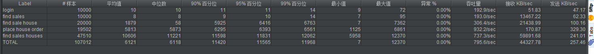

当我们尝试水平拓展时，发现加多实例，平均响应时间并没有减少，反而有所增加。一开始我们以为是edge-service的原因，但我们增加edge-service的实例数，情况并没有好转。所以估计瓶颈还是在数据库上。所以我们上了redis缓存。不过没有用到分布式锁，事务还是靠数据库来保证。

```java
//有缓存版本的下单流程
@Transactional
  public HouseOrder placeHouseOrder(int customerId, int houseOrderId, int saleId) {
    String saleHashKey = redisKey.getSaleHashKey(saleId);
    Object hstate = redisUtil.hget(saleHashKey, houseOrderId + "");
    if ("confirmed".equals(hstate)) {
      throw new InvocationException(HttpStatus.SC_BAD_REQUEST, "", "this house have been occupied first by other customer, please choose another house or try it later.");
    }
    if (isSaleOpen(saleId)) {
      SaleQualification qualification = saleQualificationDao.findBySaleIdAndCustomerId(saleId, customerId);
      if (!qualification.hasPlaceQualification()) {
        throw new InvocationException(HttpStatus.SC_BAD_REQUEST, "", "do not have the enough qualification to buy houses in this sale, " +
            "the qualifications count is " + qualification.getQualificationCount() + " , the order count is " + qualification.getOrderCount());
      }
      HouseOrder houseOrder = new HouseOrder();
      houseOrder.setId(houseOrderId);
      houseOrder.setState("confirmed");
      houseOrder.setOrderedAt(new Date());
      houseOrder.setCustomerId(customerId);
      houseOrder.setHouseId(houseOrderId);
      int count = houseOrderDao.updateByIdAndCustomerIdIsNull(customerId, houseOrder.getState(), houseOrder.getOrderedAt(), houseOrder.getHouseId());
      if (count < 1) {
        redisUtil.hset(saleHashKey, houseOrderId + "", "confirmed", 600);
        throw new InvocationException(HttpStatus.SC_BAD_REQUEST, "", "this house have been occupied first by other customer, please choose another house or try it later.");
      }
      qualification.addOrderCount();
      saleQualificationDao.saveAndFlush(qualification);
      redisUtil.hset(saleHashKey, houseOrderId + "", "confirmed", 600);
      return houseOrder;
    } else {
      throw new InvocationException(HttpStatus.SC_BAD_REQUEST, "", "this house which you chose does not belong to the current sale.");
    }
  }
```

加上缓存后，性能又有了极大的提升。

20000线程数，单一实例

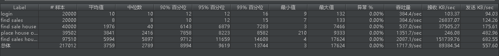

20000线程数，2个HouseOrder实例，其他的一个实例。

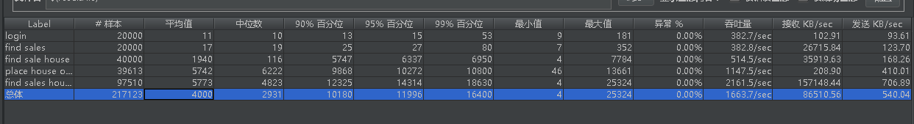

这里还是有个奇怪的现象，加实例并不能减低响应时间。

根据经验，机器扩充反而慢的情况，一般都是数据库的到达瓶颈了，特别是涉及到竞争的地方。重新分析代码，特别是有竞争的地方（findBySaleIdAndCustomerIdForUpdate）。通过关闭数据库自动提交来调试，发现并不是预想中的行锁（SaleIdAndCustomerId确定的行）,这里要给SaleId和CustomerId加联合索引。

这里解决后，20000并发可以控制在1s左右了。

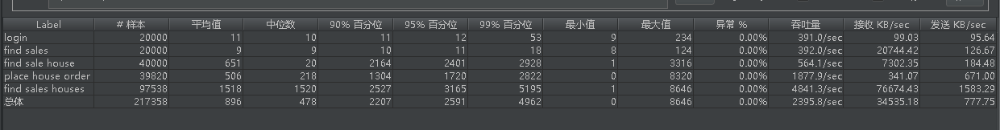

为了更好的展现微服务器的弹性和水平拓展，我们使用次一点的机器8G4核来测试。

秒杀流程中，只用到HouseOrder微服务。在其他微服务都起一个实例的情况下，HouseOrder分别起一个、两个和三个实例来测试。

一个实例

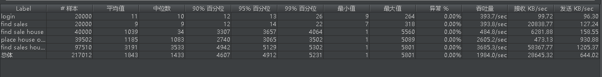

两个实例

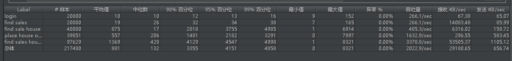

三个实例

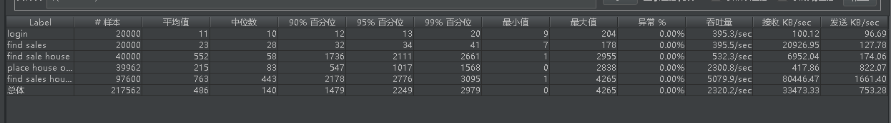

可以看出，随着实例的增加，响应时间相对应的降低。


