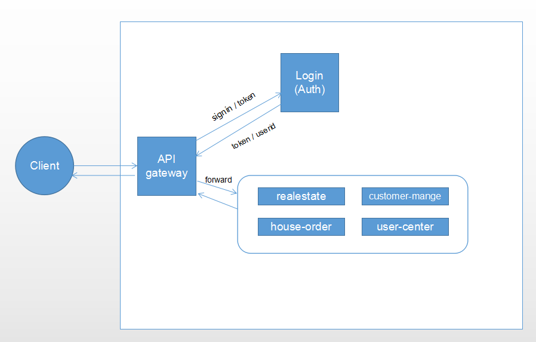

## 微服务 Edge Service

Edge Service是ServiceComb提供的JAVA网关服务开发框架。Edge Service作为整个微服务系统对外的接口，向最终用户提供服务，接入RESTful请求，转发给内部微服务。本微服务为HouseRush应用网关，作为前端与后端通信的统一入口，为房源管理、订单中心等微服务提供路由和认证鉴权的功能

### 主要功能

- API入口
- 动态路由
- 鉴权

### 设计原理

- [使用Edge Service做边缘服务](https://docs.servicecomb.io/java-chassis/zh_CN/edge/by-servicecomb-sdk.html)


### 实现

- 自定义Dispatcher

  - ```java
    public class ApiDispatcher extends AbstractEdgeDispatcher {
    
      @Override
      public int getOrder() {
        return 10002;
      }
    
      @Override
      public void init(Router router) {
        String regex = "/([^\\/]+)/(.*)";
        router.routeWithRegex(regex).handler(CookieHandler.create());
        router.routeWithRegex(regex).handler(createBodyHandler());
        router.routeWithRegex(regex).failureHandler(this::onFailure)
              .handler(this::onRequest);
      }
          protected void onRequest(RoutingContext context) {
        Map<String, String> pathParams = context.pathParams();
        String microserviceName = pathParams.get("param0");
        String path = "/" + pathParams.get("param1");
    
        EdgeInvocation invoker = new EdgeInvocation() {
          // Authentication. Notice: adding context must after setContext or will override by network
          protected void setContext() throws Exception {
            super.setContext();
            // get token from header and cookie for debug reasons
            String token = context.request().getHeader("Authorization");
            //some operation need the customerId and the customerId added in auth,
            //but the operation parameter valid check before AuthHandler,
            //it would be replaced in CustomClientFilter
            context.request().headers().add("customerId", "-1");
            if (token != null) {
              this.invocation.addContext("Authorization", token);
            } else {
              Cookie cookie = context.getCookie("Authorization");
              if (cookie != null) {
                this.invocation.addContext("Authorization", cookie.getValue());
              }
            }
          }
        };
        invoker.init(microserviceName, context, path, httpServerFilters);
        invoker.edgeInvoke();
      }
    }
    ```

  - 

- 鉴权

  - 自定义AuthHandler

    ```java
    
    public class AuthHandler implements Handler { 
      
        //RPC调用
      static {
        userApi = Invoker.createProxy("login", "userApiRest", UserApi.class);
      }
          @Override
      public void handle(Invocation invocation, AsyncResponse asyncResp) throws Exception { 
          //根据uri判断是否需要鉴权
          //向认证中心登录获取token
          //提取request的header中的Authorization字段的token
          //向认证中心检验Authorization是否有效
          //...
          if(uri需要鉴权){
          	token = invocation.getContext("Authorization");
           if (token == null) {
            asyncResp.consumerFail(...);
            return;
          	}
          	//异步调用
          	CompletableFuture<User> res = userApi.verifyToken(token);
          	res.whenComplete((resUser, e) -> {})
          }else if(不需要鉴权){
          	invocation.next(asyncResp);
          }
         
      }
        
    }
    ```