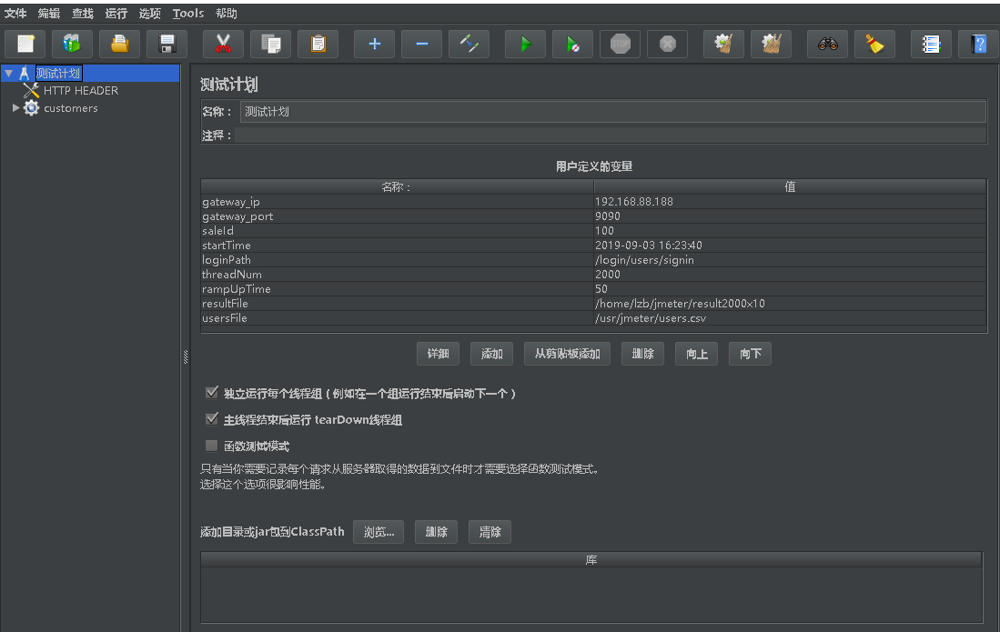

### houserush.jmx的使用

##### 说明

​	模拟场景流程：

​	1.设置一个n个线程（用户数）,m秒完全启动。（m稍微大点，保证每个用户登录成功。真实的场景也是如此，用户并不是同时登陆）

​	2.查询一次所有的开售活动、查询一次当前要抢的开售活动

​	3.查询一次当前要抢的开售活动，随机获取一个房子订单id

​	4.设置时刻定时器，到达指定时刻，即开始第5步下单，保证所以用户同时开抢

​	5.抢购第三步中随机获取的房子，如果抢购成功则当前用户完成，否则到6

​	6.再次下单该房子，如果再次不成功，则重新查询开售活动，获取一个还没有被抢的房子订单继续下单，最多循环4次。

​	7.结束

##### 环境

- 因脚本有用到fastjson,因此需要把fastjson的jar复制到jmeter目录下的lib/ext下

- 因有登陆操作，所以账号密码从csv文件读取，格式username,password。本用例数据库准备的用户的账号密码格式为customer100,123456。customer101,123456...。目录中的users.csv共有2000个用户，如不够，可以用generateUser.sh生成同样格式的账号密码

  ```shell
  ## ./generateUser.sh start end
  ./generateUser.sh 100 2100 > users.csv
  ```

##### 启动

​	双击jmeter.bat启动jmeter GUI界面，文件-->打开，选择houserush.jmx



##### 变量修改

- gateway_ip和gateway_port，网关的ip和端口
- saleId 要进行秒杀的saleId
- threadNum 和rampUpTime 总线程数和多久启动所有线程
- resultFile 结果文件
- usersFile 从哪里读取账号密码
- startTime是秒杀开始的时间。为了保证多线程同时并发，所有线程在登录完后都会在startTime之前休眠，在startTime时刻同时并发。

##### 运行

运行->启动